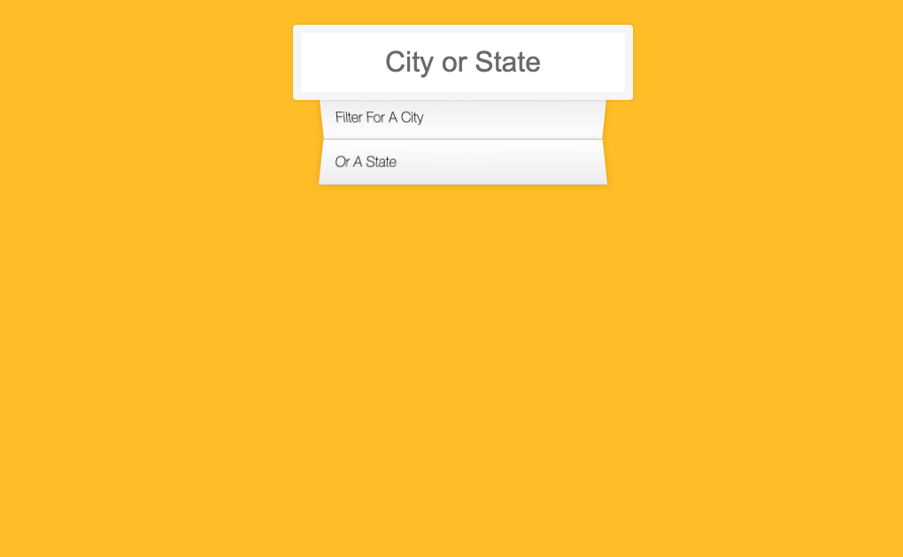
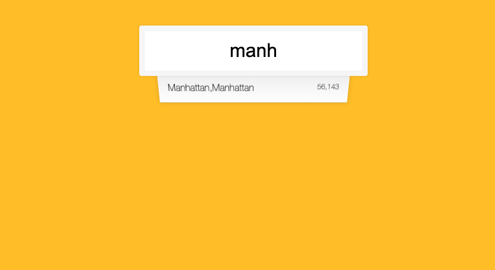

# The Odin Project Assignment

## JavaScript30 - Type Ahead

### What is this all about?

This Project is one of the minor projects assigned by `The Odin Project`'s Fundamentals series. In this assignment, actually redirected to Wes Bos' `Javascript 30`challenge,
the user start typing a city or a state, javascript engine fetches the information from json file using `fetch()` method and types ahead.

>   ### In this project I Used :
> - Json parsing with javascript,
> - Regex,
> - Dom Manipulation
> - Fetch API

## Before

## After Querying

You can find the content @ https://javascript30.com/
